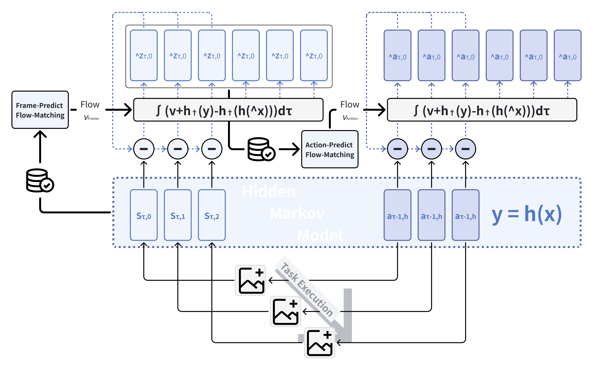
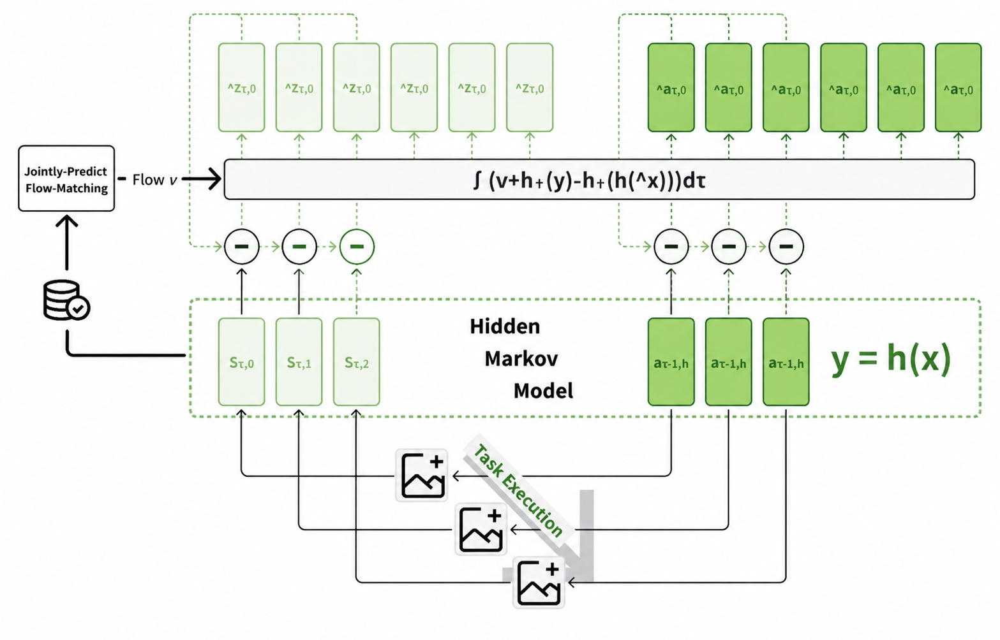

# Method

> Status: initial draft of FBFM for stage-wise and joint-generation WAMs.

## Feedback Flow Matching with Overlapping Chunks

FBFM turns chunked WAM inference into a feedback process without modifying or
retraining the pretrained model. Suppose that a new chunk is generated at
environment time \(t\) while its preceding action chunk is still being executed.
After both chunks are aligned to global environment time, let

\[
\mathcal I_t^A
=
\left\{
i\in\{0,\ldots,H-1\}:
a_{t+i}\text{ is covered by both chunks}
\right\}
\]

denote their overlap. For every \(i\in\mathcal I_t^A\), the action inherited from
the preceding chunk is denoted by \(a_{t+i}^{\mathrm{prev}}\). It is a committed
action target for the corresponding slot of the new chunk. The committed set
includes both actions that have already been sent to the environment and actions
that remain scheduled for execution from the preceding chunk. Because the robot
continues to execute that chunk in order, the position reached by the execution
pointer does not alter the overlap constraint: the two chunks must agree over the
entire aligned overlap.

Execution and generation proceed concurrently at the level of the method. Executing
\(a_{t+i-1}^{\mathrm{prev}}\) produces a real transition whose observation is encoded
as \(z_{t+i}\). At the \(k\)-th solver evaluation, we collect all state feedback that
has arrived by then in

\[
\mathcal F_{t,k}
=
\left\{
(i,z_{t+i}):i\in\{1,\ldots,H\},
z_{t+i}\text{ is available before solver evaluation }k
\right\}.
\]

The interaction history \(\mathcal H_t\) remains the condition available when the
solver is launched. In particular, newly arriving \(z_{t+i}\) is not absorbed into
or hidden by a redefinition of \(\mathcal H_t\); it is exposed explicitly through the
dynamic feedback set \(\mathcal F_{t,k}\) and its corresponding mask. This separation
is central to FBFM: the pretrained conditional model remains fixed, while real
transitions progressively constrain the chunk that is still being generated.

*FBFM for a stage-wise WAM. While the preceding chunk is executed, encoded real
observations progressively constrain the state flow. The latest corrected state
context conditions the action flow, whose overlap is constrained by the committed
actions inherited from the preceding chunk.*

## FBFM for Stage-Wise World-Action Models

A stage-wise WAM factorizes latent-state and action generation as

\[
p_\theta(\mathbf Z_t,\mathbf A_t\mid\mathcal H_t)
=
p_{\theta_Z}(\mathbf Z_t\mid\mathcal H_t)
p_{\theta_A}(\mathbf A_t\mid\mathbf Z_t,\mathcal H_t),
\]

and realizes the two factors with separate vector fields \(v_{\theta_Z}^Z\) and
\(v_{\theta_A}^A\). FBFM therefore applies separate state and action corrections,
while passing the corrected state representation to the action stage.

The stage-wise procedure follows the same state-first, action-second order as the
underlying WAM. While the preceding action chunk is being executed, generation of
the new chunk proceeds in two stages. First, as the robot executes the remaining
actions of the preceding chunk within the overlap, each action
\(a_{t+i-1}^{\mathrm{prev}}\) induces a transition in the physical or simulated
environment according to \(P(\cdot\mid s_{t+i-1},a_{t+i-1}^{\mathrm{prev}})\). The
resulting state is sensed and encoded as \(z_{t+i}\), which activates the
corresponding state mask and constrains the ongoing state flow. Second, the action
flow is conditioned on the latest corrected state context and is directly
constrained by the committed actions in the cross-chunk overlap. State feedback
that arrives after the state flow has terminated refreshes the context used by the
ongoing action flow rather than restarting state generation.

### State Flow: Dynamic State-Feedback Guidance

Let \(\tau_k^Z\) be the flow time at the \(k\)-th state-solver evaluation. The
predicted clean latent-state endpoint is

\[
\hat{\mathbf Z}_{t,k}^1
=
f_{\theta_Z}^{Z,\tau_k^Z}(\mathbf Z_t^{\tau_k^Z})
:=
\mathbf Z_t^{\tau_k^Z}
+(1-\tau_k^Z)
v_{\theta_Z}^Z
\!\left(
\mathbf Z_t^{\tau_k^Z},\tau_k^Z;\mathcal H_t
\right).
\]

We encode \(\mathcal F_{t,k}\) as an aligned state-feedback target
\(\mathbf Y_{t,k}^Z\) and a block-diagonal mask

\[
\mathbf W_{t,k}^Z
=
\operatorname{Diag}
\!\left(w_{t,1}^{Z,k},\ldots,w_{t,H}^{Z,k}\right)
\otimes\mathbf I_{d_z},
\qquad
w_{t,i}^{Z,k}>0
\Longleftrightarrow
(i,z_{t+i})\in\mathcal F_{t,k}.
\]

For an observed slot, the corresponding block of \(\mathbf Y_{t,k}^Z\) is
\(z_{t+i}\); unobserved blocks may be filled arbitrarily because their weights are
zero. Binary weights impose hard state inpainting, while weights in \([0,1]\) permit
confidence-weighted feedback. Using the aligned-coordinate approximation introduced
in the Pseudoinverse-Guided Inpainting subsection, the state discrepancy and its
VJP are

\[
\mathbf e_{t,k}^Z
=
\mathbf W_{t,k}^Z
\left[
\operatorname{vec}(\mathbf Y_{t,k}^Z)
-
\operatorname{vec}(\hat{\mathbf Z}_{t,k}^1)
\right],
\]

\[
\operatorname{vec}(\mathbf g_{t,k}^Z)
=
\left(
\frac{\partial\operatorname{vec}(\hat{\mathbf Z}_{t,k}^1)}
     {\partial\operatorname{vec}(\mathbf Z_t^{\tau_k^Z})}
\right)^{\mathsf T}
\mathbf e_{t,k}^Z.
\]

FBFM updates the state flow with

\[
v_{\mathrm{FBFM}}^Z
=
v_{\theta_Z}^Z
+\lambda_{\tau_k^Z}^Z\mathbf g_{t,k}^Z.
\]

Before every state-solver evaluation, \(\mathcal F_{t,k}\),
\(\mathbf Y_{t,k}^Z\), and \(\mathbf W_{t,k}^Z\) are refreshed. Consequently, a
latent state that becomes available during generation affects the remaining solver
steps of the same active chunk rather than waiting for the next inference call.

### Action Flow: State-Context Refresh and Previous-Action Consistency

#### State-Context Refresh

After the state flow terminates, let \(\hat{\mathbf Z}_t\) be its generated endpoint.
Additional state feedback may arrive while the action flow is still running. At an
action-solver evaluation \(k\), we reuse \(\mathbf Y_{t,k}^Z\) and
\(\mathbf W_{t,k}^Z\) for the latest feedback snapshot available at that evaluation
and form the corrected state representation by

\[
\operatorname{vec}(\check{\mathbf Z}_{t,k})
=
\left(\mathbf I-\mathbf W_{t,k}^Z\right)
\operatorname{vec}(\hat{\mathbf Z}_t)
+
\mathbf W_{t,k}^Z
\operatorname{vec}(\mathbf Y_{t,k}^Z),
\]

and expose it to the action generator through an abstract state context

\[
\mathcal C_{t,k}^Z
=
\Phi_Z(\check{\mathbf Z}_{t,k},\mathcal H_t).
\]

Here, \(\Phi_Z\) denotes the native context-construction interface of the stage-wise
WAM. It may be realized by latent tokens, intermediate features, or an updated
attention memory; FBFM does not require a particular storage mechanism. This
context-refresh condition only specifies how a stage-wise generator consumes late
state feedback. It is not an additional guidance objective or a model-specific part
of FBFM.

#### Previous-Action Consistency

Let \(\mathbf Y_t^A\) contain the actions \(a_{t+i}^{\mathrm{prev}}\) aligned to the
new action horizon, with arbitrary values outside \(\mathcal I_t^A\). We represent the
general previous-action constraint by a nonnegative weighting operator

\[
\mathbf W_t^A\in[0,1]^{D_A\times D_A},
\qquad D_A=H d_a,
\]

whose support lies on the aligned overlap. A common hard-overlap specialization is

\[
\mathbf W_t^A
=
\operatorname{Diag}
\!\left(
\mathbb 1[0\in\mathcal I_t^A],\ldots,
\mathbb 1[H-1\in\mathcal I_t^A]
\right)
\otimes\mathbf I_{d_a}.
\]

Crucially, \(\mathbf Y_t^A\) and \(\mathbf W_t^A\) describe cross-chunk consistency,
not the current execution pointer. They therefore remain fixed throughout generation
of the new chunk, regardless of which committed overlap actions have already been
executed.

At action flow time \(\tau_k^A\), the latest state context conditions the clean action
endpoint estimate

\[
\hat{\mathbf A}_{t,k}^1
=
f_{\theta_A}^{A,\tau_k^A}(\mathbf A_t^{\tau_k^A})
:=
\mathbf A_t^{\tau_k^A}
+(1-\tau_k^A)
v_{\theta_A}^A
\!\left(
\mathbf A_t^{\tau_k^A},\tau_k^A;
\mathcal H_t,\mathcal C_{t,k}^Z
\right).
\]

The action correction is then

\[
\mathbf e_{t,k}^A
=
\mathbf W_t^A
\left[
\operatorname{vec}(\mathbf Y_t^A)
-
\operatorname{vec}(\hat{\mathbf A}_{t,k}^1)
\right],
\]

\[
\operatorname{vec}(\mathbf g_{t,k}^A)
=
\left(
\frac{\partial\operatorname{vec}(\hat{\mathbf A}_{t,k}^1)}
     {\partial\operatorname{vec}(\mathbf A_t^{\tau_k^A})}
\right)^{\mathsf T}
\mathbf e_{t,k}^A,
\qquad
v_{\mathrm{FBFM}}^A
=
v_{\theta_A}^A
+\lambda_{\tau_k^A}^A\mathbf g_{t,k}^A.
\]

State feedback and previous-action consistency thus have distinct roles in a
stage-wise WAM. State feedback is asynchronous and progressively updates both the
state flow and the context consumed by the action flow. The previous-action target
is fixed by the temporal overlap and directly constrains the action flow. Their
combination closes the loop within chunk generation while preserving the original
state-first, action-second factorization.

## FBFM for Joint-Generation World-Action Models

A joint-generation WAM, also referred to here as a parallel WAM, models the latent
state and action chunks with a single conditional distribution,

\[
p_\theta(\mathbf X_t\mid\mathcal H_t),
\qquad
\mathbf X_t
=
\operatorname{concat}
\!\left(
\operatorname{vec}(\mathbf Z_t),
\operatorname{vec}(\mathbf A_t)
\right).
\]

Unlike a stage-wise WAM, it transports both modalities with one vector field
\(v_\theta^X\) and does not require a separate state-to-action context handoff. The
dynamic state feedback and the fixed previous-action target are instead assembled
into one joint constraint and applied at every evaluation of the same Flow-Matching
solver.

*FBFM for a joint-generation WAM. Encoded transitions observed while the preceding
chunk is executed and committed actions from the cross-chunk overlap jointly
constrain a single state-action flow. Through the cross-modal blocks of the endpoint
Jacobian, state feedback can directly correct the action coordinates of this flow.*

### Joint State-Action Guidance

Let \(\tau_k^X\) be the flow time at joint-solver evaluation \(k\). The predicted
clean endpoint is

\[
\hat{\mathbf X}_{t,k}^1
=
f_\theta^{X,\tau_k^X}(\mathbf X_t^{\tau_k^X})
:=
\mathbf X_t^{\tau_k^X}
+
(1-\tau_k^X)
v_\theta^X
\!\left(
\mathbf X_t^{\tau_k^X},\tau_k^X;\mathcal H_t
\right).
\]

Using the state-feedback quantities from Section 2.2 and the same aligned
previous-action target, we define

\[
\mathbf Y_{t,k}^X
=
\operatorname{concat}
\!\left(
\operatorname{vec}(\mathbf Y_{t,k}^Z),
\operatorname{vec}(\mathbf Y_t^A)
\right),
\]

\[
\mathbf W_{t,k}^X
=
\begin{bmatrix}
\mathbf W_{t,k}^Z & \mathbf 0\\
\mathbf 0 & \mathbf W_t^A
\end{bmatrix}
\in\mathbb R^{D_X\times D_X},
\qquad
D_X=D_Z+D_A,
\quad
D_Z=H d_z.
\]

The state block of \(\mathbf W_{t,k}^X\) is refreshed whenever a new
\(z_{t+i}\) becomes available, whereas its action block remains fixed by the aligned
cross-chunk overlap. The joint discrepancy and VJP are

\[
\mathbf e_{t,k}^X
=
\mathbf W_{t,k}^X
\left[
\mathbf Y_{t,k}^X
-
\operatorname{vec}(\hat{\mathbf X}_{t,k}^1)
\right],
\]

\[
\operatorname{vec}(\mathbf g_{t,k}^X)
=
\left(
\frac{\partial\operatorname{vec}(\hat{\mathbf X}_{t,k}^1)}
     {\partial\operatorname{vec}(\mathbf X_t^{\tau_k^X})}
\right)^{\mathsf T}
\mathbf e_{t,k}^X,
\qquad
v_{\mathrm{FBFM}}^X
=
v_\theta^X
+
\lambda_{\tau_k^X}^X\mathbf g_{t,k}^X.
\]

Thus, one guidance evaluation simultaneously enforces the observed state slots and
the committed action overlap while leaving all unobserved and unconstrained
coordinates to the pretrained joint model.

### Direct State-to-Action Correction

The direct coupling becomes explicit by partitioning the clean-endpoint Jacobian:

\[
\mathbf J_{t,k}^X
:=
\frac{\partial
\begin{bmatrix}
\operatorname{vec}(\hat{\mathbf Z}_{t,k}^1)\\
\operatorname{vec}(\hat{\mathbf A}_{t,k}^1)
\end{bmatrix}}
{\partial
\begin{bmatrix}
\operatorname{vec}(\mathbf Z_t^{\tau_k^X})\\
\operatorname{vec}(\mathbf A_t^{\tau_k^X})
\end{bmatrix}}
=
\begin{bmatrix}
\mathbf J_{ZZ} & \mathbf J_{ZA}\\
\mathbf J_{AZ} & \mathbf J_{AA}
\end{bmatrix},
\]

where, for \(Q,R\in\{Z,A\}\),

\[
\mathbf J_{QR}
=
\frac{\partial\operatorname{vec}(\hat{\mathbf Q}_{t,k}^1)}
     {\partial\operatorname{vec}(\mathbf R_t^{\tau_k^X})}.
\]

Partitioning
\(\mathbf e_{t,k}^X=[\mathbf e_{t,k}^Z;\mathbf e_{t,k}^A]\) and
\(\mathbf g_{t,k}^X=[\mathbf g_{t,k}^Z;\mathbf g_{t,k}^A]\), the VJP gives

\[
\begin{bmatrix}
\operatorname{vec}(\mathbf g_{t,k}^Z)\\
\operatorname{vec}(\mathbf g_{t,k}^A)
\end{bmatrix}
=
\begin{bmatrix}
\mathbf J_{ZZ}^{\mathsf T} & \mathbf J_{AZ}^{\mathsf T}\\
\mathbf J_{ZA}^{\mathsf T} & \mathbf J_{AA}^{\mathsf T}
\end{bmatrix}
\begin{bmatrix}
\mathbf e_{t,k}^Z\\
\mathbf e_{t,k}^A
\end{bmatrix}.
\]

In particular, consider state feedback alone, for which
\(\mathbf e_{t,k}^A=\mathbf 0\). The action component of the correction becomes

\[
\operatorname{vec}(\mathbf g_{t,k}^A)
=
\mathbf J_{ZA}^{\mathsf T}\mathbf e_{t,k}^Z
=
\left(
\frac{\partial\operatorname{vec}(\hat{\mathbf Z}_{t,k}^1)}
     {\partial\operatorname{vec}(\mathbf A_t^{\tau_k^X})}
\right)^{\mathsf T}
\mathbf e_{t,k}^Z.
\]

Whenever the learned joint endpoint predictor couples states and actions,
\(\mathbf J_{ZA}\neq\mathbf 0\), and a discrepancy in an observed state slot
therefore produces a nonzero correction on the action coordinates in the same
solver step. This is the principal distinction from the stage-wise formulation:
state feedback does not influence action generation only through a subsequently
refreshed context; it can directly modify the action flow through the cross-modal
Jacobian of the joint predictor. The reciprocal cross block also allows an action
residual to affect state coordinates, although FBFM primarily uses the former path
to inject real state transitions into action generation.

## Training-Free Inference

FBFM changes only the inference-time vector fields and context supplied to the
pretrained WAM. The joint parameter set \(\theta\), or the stage-wise parameter sets
\(\theta_Z\) and \(\theta_A\), remain frozen, and the VJPs are obtained by automatic
differentiation through the clean-endpoint predictors.
The method does not require a fixed ratio between environment steps and solver
steps. It only requires feedback available before a solver evaluation to be visible
to that evaluation. The concrete scheduling mechanism is therefore an experimental
property rather than part of the method definition.
