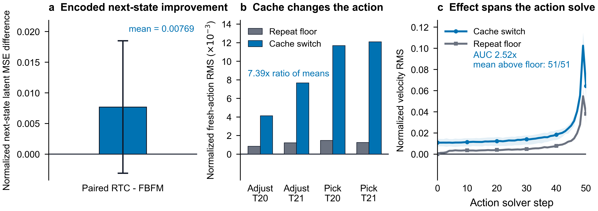
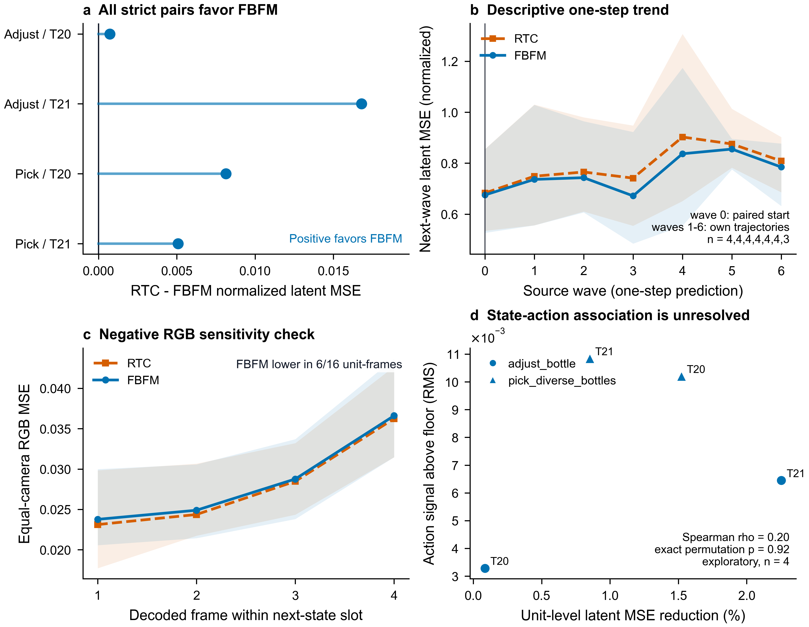
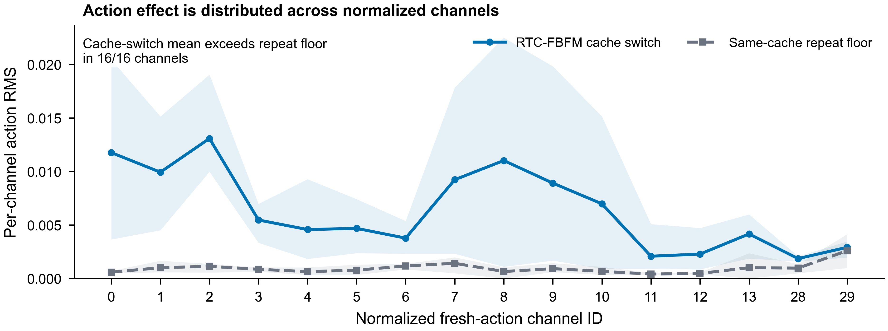

# LingBot-VA Auxiliary Mechanism Experiment

## Purpose and manuscript context

This document provides a paper-ready description and analysis of the smallest
completed LingBot-VA auxiliary experiment. It is written to match the
terminology and claim style of `fbfm_paper` at commit
`ebba5a7e456f58036e3715115f20d5d7b8fb166a`, in which LingBot-VA is the
stage-wise world-action model (WAM), observations are encoded by the frozen
VAE, the corrected video context conditions the action flow, and all pretrained
parameters remain frozen.

The experiment reuses the frozen `rapid_paper_2x2` outputs and adds no RoboTwin
episodes or model inference. It evaluates two computation-level links:

1. observation feedback to the encoded next-state estimate;
2. the state-conditioned cache to the fresh action computation.

It does not establish the third link from the changed action to episode
success. RTC, FBFM, and FBFM-CacheCut each succeeded in 3 of the same 4
task-by-trial units (75%). The auxiliary result must therefore be presented as
mechanism evidence, not as a success-rate ablation.

## Recommended placement in the paper

Add a short `Mechanism diagnostic` paragraph after the LingBot-VA description
in the Experiments section, and add a `LingBot-VA mechanism analysis`
subsection after the aggregate LingBot-VA RoboTwin result. Use Figure 1 below
as the main mechanism figure. Figures S1 and S2 are better placed in an
appendix because they expose sensitivity checks and small-sample limitations.

## Experiment design

### Frozen task set and independent unit

The frozen rapid profile contains two RoboTwin `demo_randomized` tasks,
`adjust_bottle` and `pick_diverse_bottles`, at trial ordinals 20 and 21. The
independent unit is one task-by-trial pair, giving four units. Task selection
used pre-outcome runtime criteria. Within a unit, RTC and FBFM share the task,
expert-valid trial ordinal, simulator seed, prompt, and initial history. The
two CacheCut probes in each unit are repeated measurements and are averaged
before aggregation; they are not counted as independent samples.

### Feedback to encoded next-state estimate

LingBot-VA stores two temporal slots in each saved video latent: the current
state and one predicted next state. For method (m) and unit (u), the strict
state diagnostic compares temporal slot 1 from the final wave-0 latent with
temporal slot 0 from the next realized wave:

\[
E_{m,u}
=
\frac{1}{23040}
\left\|
z^{m,u}_{\mathrm{pred},0,1}
-
z^{m,u}_{\mathrm{real},1,0}
\right\|_2^2.
\]

The 23,040 values form one state slot in LingBot-VA's standardized VAE latent
space. Each method is evaluated against the state realized in its own rollout;
using a target from the other method would mix counterfactual actions and
states. Wave 0 is the primary comparison because the RTC and FBFM histories
are still paired at the start. Later-wave measurements are retained only as a
descriptive one-step trend because the action and observation histories have
diverged.

### Encoded state/cache to fresh action

Each FBFM-CacheCut probe reruns fresh-action generation from the same inference
context while changing only the installed cache branch. One pass uses the RTC
cache branch, a second uses the FBFM cache branch, and a third repeats the RTC
branch. The real-history cache, video noise, action noise, action constraints,
and solver schedule hashes are invariant. Over the explicit mask of 256
normalized fresh-action values, the two distances are

\[
D_{\mathrm{cache}}
=
\operatorname{RMS}
\left(A_{\mathrm{RTC-cache}}-A_{\mathrm{FBFM-cache}}\right),
\]

\[
D_{\mathrm{repeat}}
=
\operatorname{RMS}
\left(A_{\mathrm{RTC-cache}}-A_{\mathrm{RTC-cache-repeat}}\right).
\]

(D_{\mathrm{repeat}}) is a same-branch numerical repeat floor, not another
method. The two probes in each task-by-trial unit are first averaged, after
which the four unit means are averaged. The same intervention is also traced
through all 51 action-solver steps and through the 16 normalized channels in
the fresh-action mask.

## Results

### Primary paired results

| Task | Trial | RTC latent MSE | FBFM latent MSE | Relative reduction | Cache-switch action RMS | Repeat-floor RMS | Ratio |
|---|---:|---:|---:|---:|---:|---:|---:|
| `adjust_bottle` | 20 | 0.855469 | 0.854743 | 0.08% | 0.004131 | 0.000846 | 4.88x |
| `adjust_bottle` | 21 | 0.745658 | 0.728860 | 2.25% | 0.007675 | 0.001228 | 6.25x |
| `pick_diverse_bottles` | 20 | 0.534707 | 0.526566 | 1.52% | 0.011692 | 0.001485 | 7.87x |
| `pick_diverse_bottles` | 21 | 0.595501 | 0.590426 | 0.85% | 0.012102 | 0.001261 | 9.59x |
| **Mean** | | **0.682834** | **0.675149** | **1.13%** | **0.008900** | **0.001205** | **7.39x** |

FBFM reduces the strict next-state latent MSE in all four paired units. The
mean absolute reduction is 0.007685, or 1.125% relative to the RTC mean. The
mean latent cosine similarity also increases from 0.524866 to 0.530125. The
two-sided 95% Student-t interval for the mean paired difference is
[-0.00313, 0.01850], and the exact two-sided sign test gives (p=0.125).
This all-positive direction is
consistent with the proposed feedback effect, but four independent units are
too few for a population-level significance claim.

Changing the cache branch changes the normalized fresh action by mean RMS
0.008900, compared with a same-branch repeat floor of 0.001205. The ratio of
these two means is 7.386, with unit-level ratios from 4.88 to 9.59. This means
that the controlled cache switch moves the computed action about 7.39 times as
far as repeating the selected cache branch under matched inputs. It does not
mean that FBFM improves task success by 7.39 times.

The cache-switch velocity RMS is above the mean repeat-floor curve at all 51
action-solver steps. Its curve AUC is 0.894198, versus 0.354747 for the repeat
floor, an AUC ratio of 2.521. The cache-switch mean also exceeds the repeat
floor in all 16 normalized action channels. Together, the final-action,
solver-trajectory, and channel analyses show that the cache effect is not
confined to one coordinate or a final rounding difference.



**Figure 1: Encoded next-state consistency and cache-to-action influence.**
**a**, Mean paired wave-0 next-state latent-MSE difference
(`RTC - FBFM`) across four independent task-by-trial units. The bar starts
at zero and the error bar is the two-sided 95% Student-t interval for the mean
paired difference; the interval is [-0.00313, 0.01850], and raw unit values
are not displayed in the main figure.
**b**, Controlled fresh-action
RMS when repeating the same RTC cache branch versus switching between the RTC
and FBFM cache branches; repeated probes are averaged within each unit, and
the four task-by-trial units are displayed as four paired bar groups without a
separate mean marker. **c**,
unit-clustered cache-switch and repeat-floor velocity RMS over the 51 action
solver steps; the repeat floor is the solid gray curve with square markers.
Shaded regions in **c** show the minimum-to-maximum range across the four
independent units, not confidence intervals. The three panels use equal-sized
plotting areas and align the `y=0` reference. Panels **b-c** reserve an
unlabeled lower margin only to preserve that alignment; their plotted values
remain nonnegative.

### Sensitivity analyses and negative results

The saved latent contains only one predicted temporal slot, so the frozen data
cannot support an honest multi-horizon latent curve. The available repeated
view is instead a one-step prediction at successive source waves. FBFM has
lower latent MSE in 34 of 44 matched unit-wave rows, with mean
(\mathrm{RTC}-\mathrm{FBFM}=0.001234). Only the four wave-0 rows are strict
paired-initial-condition evidence; later rows are descriptive because the
methods follow different histories and the number of available units falls
after source wave 5.

The decoded RGB check does not reproduce the latent-space advantage. Averaged
equally over the three cameras in a unit, the frame-wise values are:

| Decoded frame in next-state slot | RTC RGB MSE | FBFM RGB MSE |
|---:|---:|---:|
| 1 | 0.023116 | 0.023765 |
| 2 | 0.024366 | 0.024893 |
| 3 | 0.028475 | 0.028766 |
| 4 | 0.036243 | 0.036606 |

FBFM is lower in only 6 of 16 unit-frame comparisons and has a slightly higher
mean at each decoded frame. The evidence therefore supports improved
consistency in the model's encoded latent representation, not improved pixel
reconstruction.

Across the four independent units, relative latent-MSE reduction and the
cache-switch action signal above the repeat floor have Spearman
(\rho=0.20), with exact permutation (p=0.917). This sample does not resolve
a graded unit-level state-error/action-effect association and should not be
used as a mediation result.



**Figure S1: Diagnostic scope and sensitivity checks.** **a**, unit-level
strict latent-MSE reductions. **b**, the descriptive one-step latent trend for
source waves with at least three available units; wave 0 is paired, whereas
later waves follow each method's own trajectory. **c**, the negative decoded
RGB sensitivity check over the four frames represented by the next-state
slot. Bands in **b-c** show unit minima and maxima. **d**, exploratory
unit-level association between relative latent-MSE reduction and action signal
above the repeat floor; no regression line is fitted at (n=4).



**Figure S2: Normalized action-channel breakdown.** The cache-switch and
same-cache repeat-floor RMS are computed for each of the 16 channels in the
fresh-action mask. Two probes are averaged inside each task-by-trial unit; the
line is the mean of four units and the band is their minimum-to-maximum range.
Channel IDs follow the frozen normalized action tensor and are not interpreted
as commensurate physical units.

## Paper-ready insertion text

### Candidate text for the Experiments section

**LingBot-VA mechanism diagnostic.** We additionally test the two
computation-level links implied by state-context refresh in the stage-wise WAM.
The frozen diagnostic covers two RoboTwin `demo_randomized` tasks and trials
20-21, giving four independent task-by-trial units. For the state link, we
compare the wave-0 predicted next-state slot with the next wave's realized
state slot in LingBot-VA's standardized VAE latent space. RTC and FBFM are
paired by task, simulator seed, prompt, and initial history, and each method is
scored against its own realized next state. For the action link, eight
controlled CacheCut probes switch only the installed RTC versus FBFM cache
branch while holding real history, video and action noise, constraints, and
the solver schedule fixed. A same-branch RTC repeat estimates the numerical
floor. The two probes per task-by-trial unit are averaged before aggregation;
causal waves, solver steps, and action channels are treated as repeated
measurements rather than independent samples.

### Candidate text for Results and Discussion

**LingBot-VA mechanism analysis.** FBFM lowers the wave-0 next-state latent MSE
in all four paired units, reducing the mean from 0.6828 under RTC to 0.6751
(1.13%) and increasing mean cosine similarity from 0.5249 to 0.5301. The mean
paired difference is 0.00769 (95% Student-t interval [-0.00313, 0.01850]), and
the exact two-sided sign test is (p=0.125), so the consistent direction is
task-set-specific mechanism evidence rather than a population-level
significance result. In the controlled cache intervention, switching between
the RTC and FBFM cache branches changes the normalized fresh action by RMS
0.00890, compared with 0.001205 for repeating the RTC cache branch under the
same inputs, a 7.39x ratio of means. The cache-switch velocity difference
remains above the mean repeat floor at all 51 action-solver steps, with a 2.52x
solver-curve AUC ratio, and its mean exceeds the floor in all 16 normalized
fresh-action channels. These results support the computation-level chain from
observation feedback to an encoded next-state estimate and from the resulting
cache context to fresh-action generation in the stage-wise WAM.

The claim is representation-specific and stops before task success. FBFM is
lower in only 6 of 16 decoded RGB unit-frame comparisons, and RTC, FBFM, and
the cache-cut intervention each solve 3 of the 4 rapid units. Moreover, the
unit-level association between latent-MSE reduction and action signal is not
resolved ((\rho=0.20), exact permutation (p=0.917), (n=4)). We therefore
do not interpret the 7.39x action-distance ratio as a success-rate multiplier
or claim a complete mediation path.

## Interpretation and claim boundary

The strongest defensible reading is asymmetric:

- The first link has a small but consistent direction: FBFM improves the
  encoded next-state match in 4 of 4 paired units, with a 1.13% mean reduction.
- The second link has a larger controlled signal: changing only the cache
  branch produces a fresh-action difference 7.39 times the repeat floor and a
  higher mean velocity-difference curve at every solver step.
- The experiment does not connect that action difference to success, because
  all three rapid methods have the same 3/4 success count.

Do not claim that FBFM improves a four-frame latent prediction horizon: the
latent stores only one predicted temporal slot. Do not present later source
waves as independent or still-paired observations. Do not claim better RGB
prediction from this dataset. Do not call the 7.39x value a performance gain,
and do not claim a state-action mediation relationship from four units.

The frozen outputs also do not contain a teacher-forced action key/value cache
constructed from the realized future observation. A saved VAE observation
latent is not interchangeable with that cache. Consequently, a
ground-truth-cache oracle cannot be reconstructed without a new inference path
and is intentionally not fabricated here.

## Statistical and visual conventions

- The independent unit is task by trial ((n=4)).
- The two CacheCut probes are clustered within each unit before averaging.
- Frame, causal-wave, solver-step, and action-channel values are repeated
  measurements, not extra sample size.
- The strict directional test is an exact two-sided sign test.
- The exploratory association uses all 24 permutations of four unit labels.
- The error bar in Figure 1a is the two-sided 95% Student-t interval for the
  mean paired difference across four independent units.
- Figure bands are unit minima and maxima. They are not confidence intervals.
- FBFM is encoded by a blue solid line with circle markers; RTC is orange with
  a dashed line and square markers. In Figure 1c, the repeat floor is a gray
  solid line with square markers; Figure S2 retains a gray dashed line.
- Vector PDF and SVG files accompany 600-dpi PNG files.

## Reproduction and audit files

Run from this package directory:

```bash
python -m pip install -r requirements.txt
python scripts/build_visualization.py
```

The script reads only `data/source`, writes tidy tables to `data/derived`, and
regenerates all figure formats in `figures`. `provenance.json` records input
and output SHA-256 hashes, the paper-context commit, the independent-unit
definition, and software versions. `data/derived/statistical_summary.csv`
contains all headline values in machine-readable form.

The paper context was inspected without altering the target commit. Because
`docs/preview.pdf` is ignored and not stored in that commit, an equivalent PDF
was compiled from its tracked `preview.tex`, chapter files, and figures in an
isolated working copy. The reconstructed context PDF is intentionally not
duplicated in this result package.
